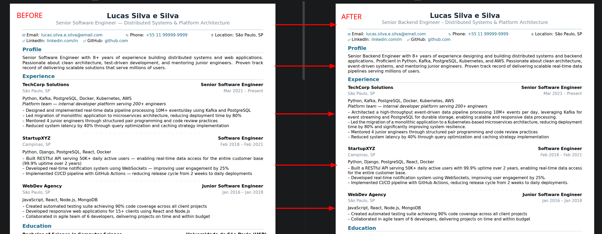

# hirepaper

**JSON → LaTeX → PDF resume generator**

`hirepaper` takes a structured JSON resume, renders it through a LaTeX template, and produces an ATS-safe PDF — all from the command line.

## Pipeline

```
candidate.json → Python data model → LaTeX template → LuaLaTeX → PDF → ATS validation
```

## Features

- Structured JSON input with schema validation
- ATS-safe PDF output (text extraction, fonts, metadata)
- LLM-powered content matching and tailoring against vacancy descriptions
- Two density modes: `compact` and `full`
- Clickable email (`mailto:`) and phone (`tel:`/WhatsApp) hyperlinks
- Locale support (en, pt-BR)
- Single-file binary packaging via PyInstaller

## Before & After

Below is a visual comparison between a standard resume PDF and a version tailored to a specific vacancy using LLM-powered content rewriting.



The tailored candidate JSON was generated with:

```bash
hirepaper content tailor data/candidate.json data/vacancy.txt \
  --output data/candidate-tailored.json \
  --inference high \
  --mode rewrite
```

Sample files:
- **Standard input:** [`data/candidate.json`](data/candidate.json)
- **Tailored output:** [`data/candidate-tailored.json`](data/candidate-tailored.json)
- **Standard PDF:** [`docs/examples/hirepaper-sample.pdf`](docs/examples/hirepaper-sample.pdf)
- **Tailored PDF:** [`docs/examples/hirepaper-sample-tailored.pdf`](docs/examples/hirepaper-sample-tailored.pdf)

## Prerequisites

- Python ≥ 3.10
- LuaLaTeX (`lualatex`, `luaotfload`)
- `rsvg-convert` (librsvg)
- `pdftotext`, `pdffonts` (poppler-utils)
- `exiftool`

## Quick Start

```bash
# Run from source
./hirepaper-dev doctor
./hirepaper-dev content init --output my-candidate.json
./hirepaper-dev content lint my-candidate.json
./hirepaper-dev pdf generate my-candidate.json --output resume.pdf --locale en

# Build packaged binary
.venv/bin/python build.py

# Run packaged
./hirepaper doctor
./hirepaper pdf generate my-candidate.json --output resume.pdf --locale en
./hirepaper pdf check resume.pdf
```

## Commands

| Command | Description |
|---|---|
| `hirepaper init` | Bootstrap a local `config.toml` |
| `hirepaper doctor` | Environment diagnostics |
| `hirepaper content init` | Bootstrap a starter candidate JSON |
| `hirepaper content lint` | Validate candidate JSON quality |
| `hirepaper content match` | ATS-style LLM compatibility analysis |
| `hirepaper content tailor` | Tailor candidate to a vacancy |
| `hirepaper pdf generate` | Generate PDF from candidate JSON |
| `hirepaper pdf check` | ATS-safety validation on a PDF |
| `hirepaper llm health` | LLM connectivity test |
| `hirepaper llm usage` | Token usage diagnostic |
| `hirepaper linkedin generate` | LinkedIn-focused report generation |

## Development

```bash
# Install dependencies
python3 -m venv .venv
source .venv/bin/activate
pip install -r requirements.txt

# Run from source
./hirepaper-dev --help

# Build binary
.venv/bin/python build.py
```

## Documentation

- [project.md](project.md) — architecture, layout, density, packaging
- [docs/content.md](docs/content.md) — `content` command reference
- [docs/pdf.md](docs/pdf.md) — `pdf` command reference
- [docs/content-match.md](docs/content-match.md) — `content match` detailed usage
- [docs/content-tailor.md](docs/content-tailor.md) — `content tailor` detailed usage
- [docs/content-match.md](docs/content-match.md) — `content match` detailed usage
- [docs/file-map.md](docs/file-map.md) — source layout and important paths
- [agents.md](agents.md) — agent execution rules
- [sdd/backlog/](sdd/backlog/) — planned tasks
- [sdd/history/](sdd/history/) — completed task records

## Support

`hirepaper` is maintained as an independent project.

If it is useful to you, you can support ongoing development and maintenance via
GitHub Sponsors:

- [Sponsor on GitHub](https://github.com/sponsors/Lucas-Palomo)
